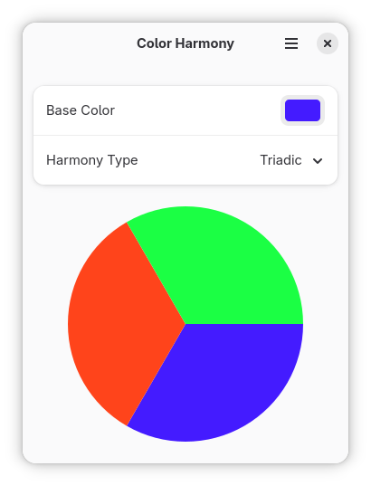

# harmony
A color harmony viewer for GNOME, created with GTK4 and Libadwaita.



## Building and Running

### Using Flatpak / GNOME Builder (Recommended)
1. Open the project in GNOME Builder.
2. Press **Run**.

### Manual Build with Meson
```bash
meson setup build
ninja -C build
./build/src/harmony
